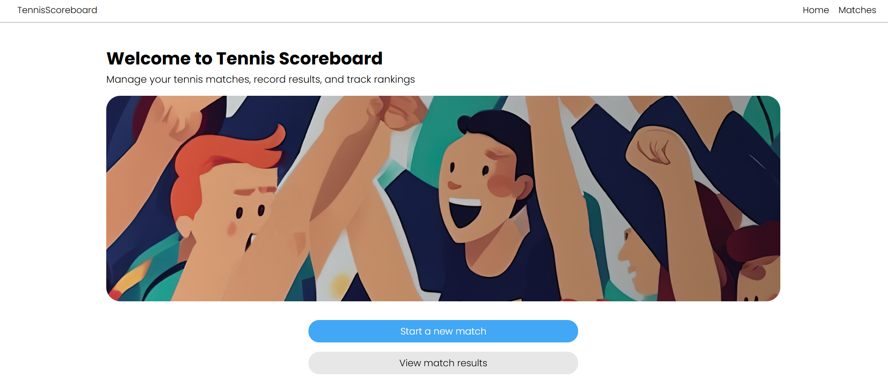
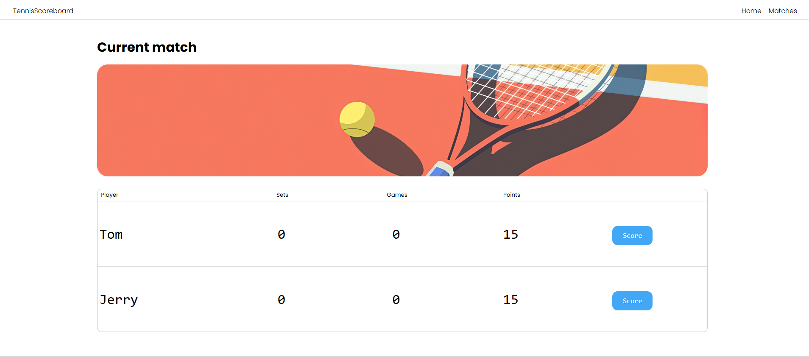
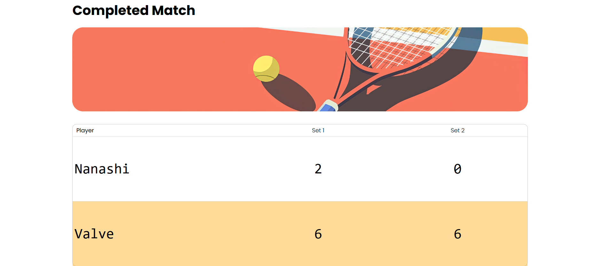
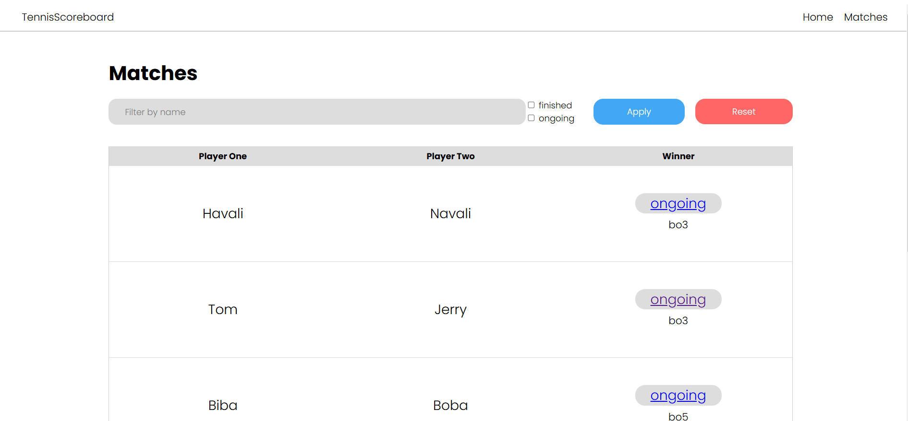

# Табло теннисного матча

Веб-приложение, реализующее табло счёта теннисного матча.
## Функционал приложения
* Создание нового матча
* Просмотр законченных матчей, поиск матчей по именам игроков
* Подсчёт очков в текущем матче


## Запуск проекта
### Через виртуальное окружение
1. Склонировать репозиторий https://github.com/ratmeow/tennis_scoreboard.git
2. Убедитесь, что у вас установлен Poetry
3. Установить зависимости `poetry install`
4. Выполнить начальную миграцию `alembic upgrade head`
5. Запустить скрипт, выполнив `python main.py` в терминале.

### Через docker
1. Склонировать репозиторий https://github.com/ratmeow/tennis_scoreboard.git
2. Выполнить `docker-compose up -d`

* Приложение будет доступно по адресу http://127.0.0.1:8080

## Тестирование
Выполнить `pytest tests/test_match_observer.py`

## Примечание
* При первом запуске проекта создается файл БД в папке data/
* Также создается файл `package.log`, который будет содержать логи приложения

## Preview






## Стек 

* Python 3.12
* waitress
* jinja2
* alembic
* SQLite

В качестве линтера используется `ruff`. Также он используется для форматирования кода.
Ниже приведены примеры команд для проверки кода ruff'ом.
```shell
ruff check src/ --select I
ruff check tests/ --select I
ruff check src/ --ignore F821
ruff check tests/
ruff format --check src/
ruff format --check tests/
```
Для автоматического исправления кода для `ruff check` нужно добавить `--fix`.
Для форматирования кода в `ruff format` нужно убрать флаг `--check`.